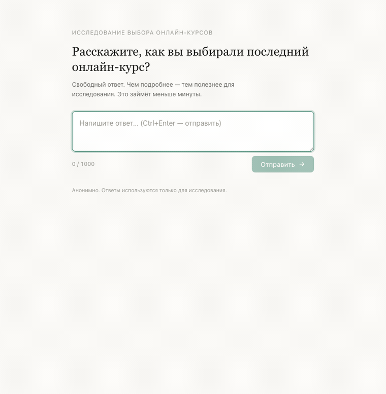

# ИИ-исследователь выбора онлайн-курсов

Веб-инструмент: задаёт один вопрос — «Расскажите, как вы выбирали последний онлайн-курс?» — и реагирует на глубину ответа. Поверхностный ответ → один уточняющий вопрос; подробный → благодарность и завершение.

**🌐 Живое демо:** **https://ai-research-interviewer.duckdns.org** — открыть и попробовать. Развёрнуто на VPS за Caddy (автоматический HTTPS), endpoint защищён rate-limiting'ом.



**Стек:** FastAPI (Python) · один HTML-файл с ванильным JS · LLM через [Ollama Cloud](https://ollama.com).

## Запуск

```bash
python -m venv .venv && source .venv/bin/activate   # Windows: .venv\Scripts\activate
pip install -r requirements.txt
cp .env.example .env                                 # впишите OLLAMA_API_KEY
uvicorn app.main:app --reload
```

Откройте <http://127.0.0.1:8000>.

### Через Docker

```bash
docker build -t course-interviewer .
docker run -e OLLAMA_API_KEY=ваш_ключ -e OLLAMA_MODEL=deepseek-v3.2 -p 8000:8000 course-interviewer
```

## Переменные окружения (`.env`)

| Переменная | Назначение | По умолчанию |
|---|---|---|
| `OLLAMA_API_KEY` | Ключ Ollama Cloud (обязательно) | — |
| `OLLAMA_MODEL` | Тег модели | `deepseek-v3.2` |
| `OLLAMA_BASE_URL` | Адрес API | `https://ollama.com` |

Ключ создаётся на <https://ollama.com/settings/keys>. Список доступных моделей:

```bash
curl -H "Authorization: Bearer $OLLAMA_API_KEY" https://ollama.com/api/tags
```

## Структура

```
app/
  main.py      # FastAPI: GET / (фронт), POST /api/ask
  config.py    # настройки из .env
  schemas.py   # контракты + JSON-схема для модели
  prompt.py    # системный промпт
  llm.py       # клиент Ollama Cloud
static/index.html   # фронтенд целиком
tests/test_api.py   # тесты (LLM замокан, без сети)
```

## API

`POST /api/ask`

```jsonc
// запрос
{ "answer": "текст ответа", "history": [] }
// ответ
{ "decision": "clarify", "reply": "уточняющий вопрос или благодарность" }
```

`decision` — `clarify` (нужен один уточняющий вопрос) или `complete` (интервью завершено).

## Тесты

```bash
pytest
```
